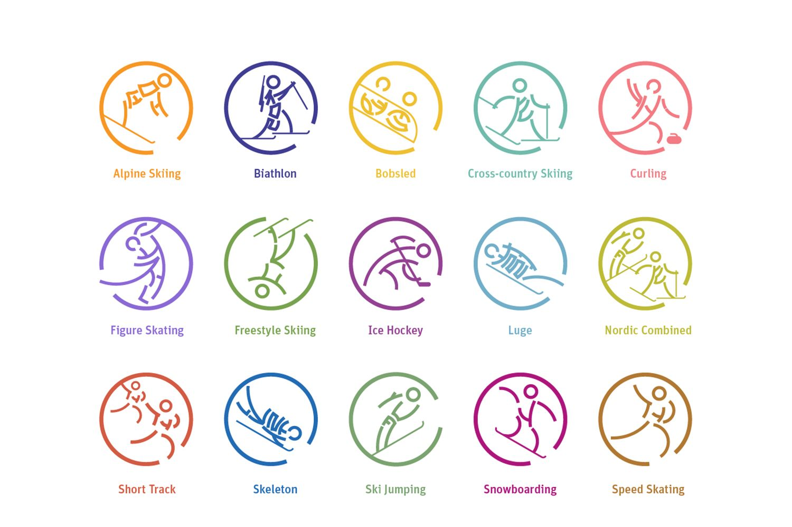

# INFORMAION ABOUT UKRAINIAN RESULTS
# IN OLYMPIC GAMES 1896-2014
## This page shows:
 1 Comparison of gold silver and bronze medals; 
 2 Compares quantity of medals won by men and women;
 3 Most successful years;
 4 sports where we won most of medals

Have a look at [Roadmap](https://docs.google.com/document/d/1yl2jzuxMyKHJQN6axxbex7M58t2m7OUnSb5yCIGljQY/edit?usp=sharing) 

## Author 
 Vladyslav zdir
## License 
All rights reserved